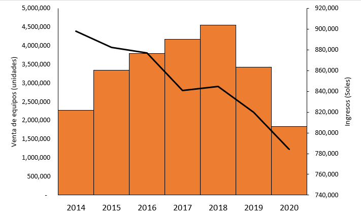

La empresa operadora *XYZ* es una de las 4 empresas que proveen el servicio móvil en el Perú. Y, si bien el servicio antes citado es su actividad principal, no se debe perder de vista que sus abonados, para hacer uso del mismo, deben contar con un equipo móvil (*handset*).

Al respecto, recientemente se ha advertido una caída sustancial en los ingresos por venta de equipos, pese a que la planta de abonados ha aumentado.

  

# a. Problemática:
  * La venta de equipos móviles viene cayendo por parte de la empresa operadora *XYZ*.

# b.1. Categoría:
  * Marketing.

# b.2. Caso de uso:
  * Generación de prospectos (Leads).